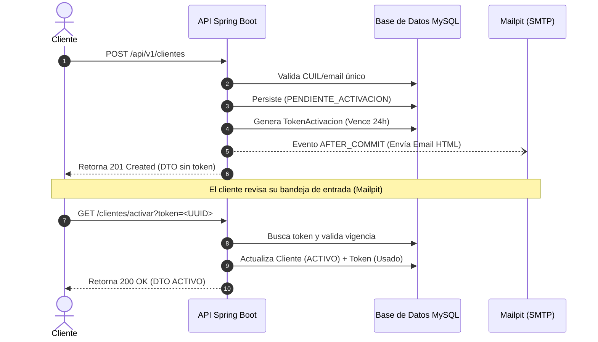

<div align="center">

# 🏔️ PunaCode Labs 🚀
### Sistema Bancario Inteligente

<p>
  
  
  
  
</p>

*Trabajo Práctico N° 2 · Entrega TP5* <br>
**"Construyendo cimientos robustos desde las alturas de Jujuy para el mundo."**

---
</div>

## 🏦 Sobre el Proyecto

Bienvenido al repositorio oficial del **Sistema Bancario**, desarrollado en el marco de la materia **Desarrollo y Arquitecturas Avanzadas de Software (DAAS)** de la **Facultad de Ingeniería - Universidad Nacional de Jujuy (UNJu)**.

Este sistema implementa un backend moderno, seguro y altamente estructurado bajo los principios de la arquitectura de software multiniveles, aplicando patrones de diseño avanzados, persistencia con mapeo objeto-relacional (ORM) y un estricto control de auditoría de transacciones.

> **✨ Novedades Entrega TP5:** Incorpora alta y activación de clientes por email, reglas de adherentes, topes diarios de extracción, y una **liquidación mensual automática de comisiones** (`@Scheduled`).

<br>

## 🛠️ Stack Tecnológico

<div align="center">
  
  
  
  
  
  
</div>

*   **Persistencia:** Spring Data JPA con UUIDs binarios (`BINARY(16)` mediante `UUID_TO_BIN()`)
*   **Correo (Desarrollo):** Mailpit (SMTP local en `localhost:1025` · UI en `localhost:8025`)
*   **Gestión & Utils:** Maven · Lombok · JPA Auditing

<br>

## 📐 Decisiones Arquitectónicas Destacadas

1. 🧬 **Herencia `InheritanceType.JOINED`:** Jerarquía `CuentaFinanciera` → `CajaAhorro` / `CuentaCorriente`, normalizada en tablas unidas.
2. 🔑 **Identificadores UUID Binarios:** Uso de `BINARY(16)` para identidad global con máximo rendimiento.
3. 📜 **Auditoría Automática:** Superclase `EntidadAuditable` transversal (`created_date`, `last_modified_date`).
4. 📨 **Eventos de Dominio Resilientes:** El email de activación se envía **después del commit** (`@TransactionalEventListener(AFTER_COMMIT)`) de forma asíncrona; un fallo SMTP jamás revierte el alta del cliente.
5. 🛡️ **Configuración Tipada:** Records `@ConfigurationProperties` (`app.*`) validados.
6. 🔄 **Liquidación Idempotente:** Cada cuenta activa se debita en transacciones aisladas (`REQUIRES_NEW`); un fallo no frena el lote completo.

<br>

## 🚀 Puesta en Marcha (Desde Cero)

### 1. Pre-requisitos
* Docker y Docker Compose
* **JDK 25**
* Maven (`./mvnw` incluido en el repo).

### 2. Variables de Entorno (`.env`)
Crear el archivo `.env` en la raíz (no se commitea):
```properties
DB_NAME=sistema_bancario
DB_USERNAME=banco_user
DB_PASSWORD=0987654321
DB_ROOT_PASSWORD=0987654321
```

### 3. Levantar la Infraestructura
```bash
docker compose up -d
```
> **Servicios:** MySQL (`localhost:3308`) y Mailpit (SMTP `1025` / UI `http://localhost:8025`).

### 4. Ejecutar la Aplicación
```bash
bash ./mvnw spring-boot:run
```
> 💡 *En cada arranque, `data.sql` resetea la base a un dataset demo coherente (4 cuentas, 6 clientes, transacciones). La API queda en `http://localhost:8080/api/v1`.*

<br>

## 🧮 Reglas de Negocio TP5

### 👨‍👩‍👦 Adherentes y Topes Diarios

*   **Roles:** Un cliente es `TITULAR` o `ADHERENTE` (`CONYUGE`, `HIJO`). Un adherente no puede tener adherentes propios.
*   **Activación:** Todo cliente nace `PENDIENTE_ACTIVACION` y debe activarse con token (email).
*   **Operatividad:** El adherente opera sobre las cuentas de su titular (`clienteEjecutorId`).
*   **Depósitos:** Exclusivos para titulares. Adherentes → `403 Operación no permitida`.
*   **Extracciones (Topes Diarios):**
    *   Titular: `$100,000.00`
    *   Adherente: `$70,000.00`
    *   *Nota: Exceder el tope genera un error `400` y registra la transacción como `RECHAZADA`.*

### 📅 Liquidación Mensual Automática
*   **Cron:** Ejecutado vía `@Scheduled` (`0 0 0 1 * *` → 1er día del mes a las 00:00).
*   **Proceso:** Debita a cuentas `ACTIVA` registrando una transacción `DEBITO_COMISION` (`COMPLETADA`, `ejecutor=null`).
*   **Costos:** Cuenta Corriente (`$5000.00`), Caja de Ahorro (`$2000.00`).
*   **Disparo Manual:**
    ```bash
    curl -X POST http://localhost:8080/api/v1/admin/comisiones/liquidar
    ```

<br>

## ✉️ Flujo de Alta y Activación por Email



<br>

<details>
<summary><b>🔌 Ver Endpoints Principales (Click para expandir)</b></summary>

#### Clientes
| Método | Ruta | Descripción |
| :--- | :--- | :--- |
| `POST` | `/api/v1/clientes` | Alta de titular |
| `POST` | `/api/v1/clientes/{titularId}/adherentes` | Alta de adherente |
| `GET` | `/api/v1/clientes/activar?token={uuid}` | **Activación por token** |
| `GET` | `/api/v1/clientes` · `/{id}` · `/{id}/adherentes` | Consultas |

#### Cuentas
| Método | Ruta | Descripción |
| :--- | :--- | :--- |
| `POST` | `/api/v1/cuentas` | Alta de cuenta (CA/CC según DTO) |
| `GET` | `/api/v1/cuentas` · `/{id}` · `/cbu/{cbu}` · `/alias/{alias}` | Consultas |
| `POST` | `/api/v1/cuentas/{id}/depositar?monto=` | Depósito directo |
| `POST` | `/api/v1/cuentas/{id}/extraer?monto=` | Extracción directa |

#### Transacciones
| Método | Ruta | Descripción |
| :--- | :--- | :--- |
| `POST` | `/api/v1/transacciones/deposito` | Depósito (solo titular) |
| `POST` | `/api/v1/transacciones/extraccion` | Extracción (con tope diario) |
| `GET` | `/api/v1/transacciones` · `/cuenta/{id}` · `/tipo/{tipo}` | Consultas y filtros |
</details>

<details>
<summary><b>⚙️ Ver Configuración y Variables de Entorno (Click para expandir)</b></summary>

| Propiedad `app.*` | Valor Default | Descripción |
| :--- | :--- | :--- |
| `app.comisiones.cuenta-corriente` | `5000.00` | Comisión mensual (CC) |
| `app.comisiones.caja-ahorro` | `2000.00` | Comisión mensual (CA) |
| `app.comisiones.cron` | `0 0 0 1 * *` | Cron de liquidación |
| `app.limites.extraccion-diaria.titular` | `100000.00` | Tope diario titular |
| `app.limites.extraccion-diaria.adherente` | `70000.00` | Tope diario adherente |

| Variable Entorno | Default | Descripción |
| :--- | :--- | :--- |
| `MAIL_HOST` | `localhost` | Host SMTP |
| `MAIL_PORT` | `1025` | Puerto SMTP |
| `APP_BASE_URL` | `http://localhost:8080` | URL base del enlace de activación |
| `APP_COMISIONES_CRON` | - | Override del cron de liquidación |
</details>

<br>

## 🗂️ Verificación y Pruebas

### Colección Postman TP5
Se incluye la colección **`postman/TP2-DAAS.postman_collection.json`** con los escenarios de aceptación listos para ejecutar:
1. Alta + activación.
2. Token expirado (forzar en BD restando 1 día al vencimiento).
3. Adherente intentando depositar (Rechazo).
4. Exceso de tope diario.
5. Liquidación manual.

### Suite de Tests Automáticos
Para verificar la integridad del sistema:
```bash
bash ./mvnw clean test
# → Tests run: 60, Failures: 0, Errors: 0, Skipped: 0
```

<br>

## 👥 El Equipo de Ingeniería (PunaCode Labs)

| Integrante | Rol en la Fábrica de Software |
| :--- | :--- |
| **Villalva, Elias Maciel** | 🏛️ Lead Backend & Architecture Engineer |
| **Carrillo, Gonzalo Alejo** | 🗄️ Database & Domain Modeling Engineer |

📍 **Ubicación:** San Salvador de Jujuy, Argentina 🇦🇷 <br>
🎓 **Carrera:** Ingeniería Informática

---
<div align="center">
  <i>Desarrollado con 💻 y mucho ☕ para la UNJu.</i>
</div>